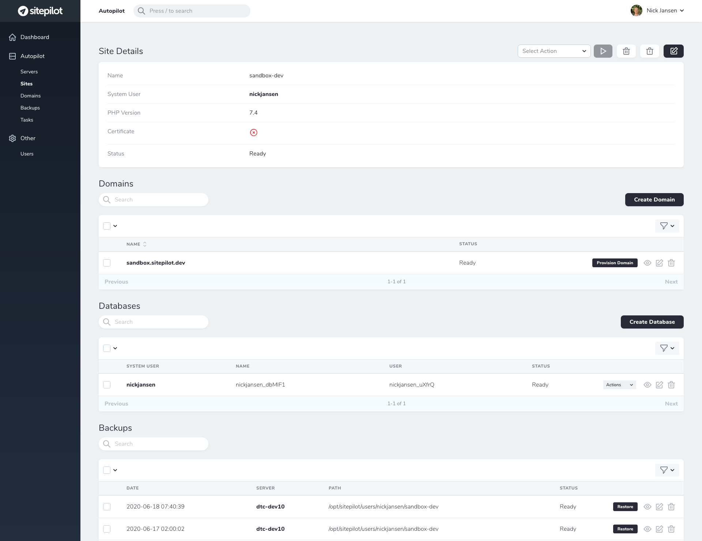
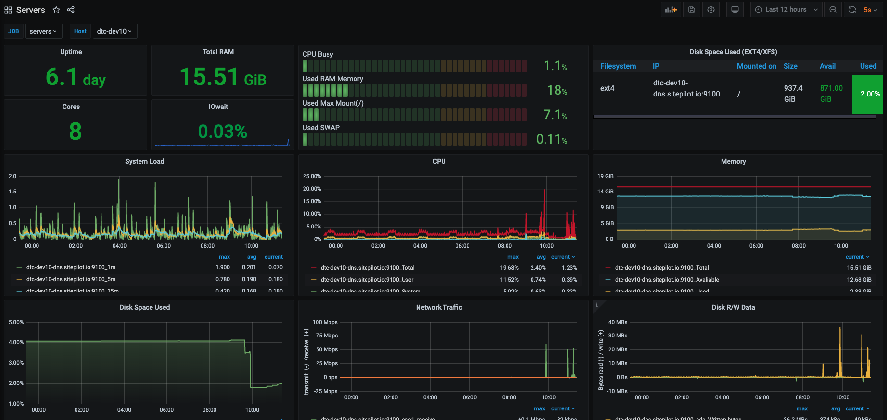

# Autopilot

Autopilot is a (cloud) webhosting control panel for managing multiple servers, sites and WordPress installations. We use Autopilot at [Sitepilot](https://sitepilot.io) for our managed WordPress webhosting platform. With Autopilot you can:

* Provision WordPress optimized web servers.
* Monitor server and site health of the provisioned servers and sites.
* Manage and maintain WordPress sites.

Autopilot is build on top of [Laravel](https://laravel.com/) and uses [Ansible](https://www.ansible.com/) to provision servers, users, databases and sites on Ubuntu 20.04 LTS servers.

## Supported Server Providers

Autopilot supports the following server providers:

* [UpCloud](https://upcloud.com/signup/?promo=HGMAN9)

If your preferred provider is not baked into Autopilot, you can always use the Custom VPS option. There are a few requirements to ensure that this works successfully:

* The server your connecting to must be running a fresh installation of Ubuntu 20.04 LTS.
* Your server must be accessible by the Autopilot host.
* There must be a root user with no password.

## Web Server Configuration

### Packages & Services

The following packages/services will be installed and configured on web servers (together with dependencies):

* [Caddy Web Server (for proxy and auto ssl)](https://caddyserver.com/)
* [OpenLitespeed (web server)](https://www.litespeedtech.com/open-source/openlitespeed)
* [LSPHP 7.4](https://www.litespeedtech.com/open-source/litespeed-sapi/php)
* [LSPHP 7.3](https://www.litespeedtech.com/open-source/litespeed-sapi/php)
* [Composer](https://getcomposer.org/)
* [WPCLI](https://wp-cli.org/)
* [WordMove](https://github.com/welaika/wordmove)
* [UFW (firewall)](https://help.ubuntu.com/community/UFW)
* [OpenSSH Server & SFTP](https://www.openssh.com/)
* [SSMTP (email relay)](https://wiki.archlinux.org/index.php/SSMTP)
* [Restic (for backups)](https://restic.net/)
* [Docker](https://www.docker.com/)
* [Docker Compose](https://hub.docker.com/_/redis/)
* [Docker Redis 5](https://redis.io/)
* [Docker MariaDB 10.4](https://hub.docker.com/_/mariadb)
* [Docker phpMyAdmin 5](https://www.phpmyadmin.net/)
* [Docker Node Exporter (for monitoring)](https://prometheus.io/docs/guides/node-exporter/)

Users are isolated and allowed to use SFTP with password authentication (chroot directory `/opt/sitepilot/users/%u`).

### Tools

* phpMyAdmin: `http://<domain.name>/.sitepilot/pma/`.
* Health check: `http://<domain.name>/.sitepilot/health/`.
* Node Exporter: `http://<domain.name>/.sitepilot/node-exporter/`.

### Filesystem

* Users folder: `/opt/sitepilot/users`.
* Site public folder: `/opt/sitepilot/users/{{ user.name }}/{{ app.name }}/public`.
* Site logs folder: `/opt/sitepilot/users/{{ user.name }}/{{ app.name }}/logs`.
* Caddy service folder: `/opt/sitepilot/services/caddy`.
* OpenLitespeed service folder: `/opt/sitepilot/services/olsws`.
* MySQL service folder: `/opt/sitepilot/services/mysql`.
* Redis service folder: `/opt/sitepilot/services/redis`.
* Node Exporter service folder: `/opt/sitepilot/services/node-exporter`.
* phpMyAdmin service folder: `/opt/sitepilot/services/phpmyadmin`.

## Monitoring

Autopilot uses [Prometheus](https://prometheus.io/), [Alertmanager](https://prometheus.io/docs/alerting/latest/alertmanager/), [Blackbox Exporter](https://github.com/prometheus/blackbox_exporter) and [Grafana](https://grafana.com/) to monitor servers and sites. These services are included in the [Autopilot Stack](https://github.com/sitepilot/autopilot-stack).

## Installation & Contributing

### Licenses

* [Laravel Nova License](https://nova.laravel.com/): Autopilot uses Laravel Nova for managing resources. A valid Laravel Nova license is required when installing Autopilot. Composer will prompt for the username and password to validate your license while installing packages.

### Installation

The recommended way to install Autopilot is using the preconfigured Autopilot Stack. [You can find the installation instructions here.](https://github.com/sitepilot/autopilot-stack)

### Contributing

Thank you for considering contributing to Autopilot! Follow these steps to install Autopilot on your server:

* Clone this repository to your web server.
* Copy the example environment file and modify it to your needs: `cp .env.example .env`.
* Install Composer packages with `composer install`. *NOTE: Composer will prompt for your Laravel Nova username and password to validate your license.*
* Generate an application key with `php artisan key:generate`.
* Migrate and seed the database with `php artisan migrate --seed`.
* Navigate to the application domain and login. Default user: `admin@autopilot.local`, default password: `supersecret`.

#### Environment Requirements

The following software must be installed on the server in order to manually install Autopilot:

* PHP7.4
* Ansible
* Composer

*NOTE: These packages are included in the Autopilot Docker container.*

#### Commands

* Autopilot uses [Laravel Horizon](https://laravel.com/docs/7.x/horizon) to process Redis queues. To start the configured queue workers run: `php artisan horizon`.
* Autopilot uses [Laravel Task Scheduling](https://laravel.com/docs/7.x/scheduling) to schedule tasks. To test scheduled tasks run: `php artisan schedule:run`.

*NOTE: These commands are preconfigured to run in the Autopilot Docker container.*

## Screenshots 

## License

MIT / BSD

## Author

Autopilot was created in 2020 by [Nick Jansen](https://nbejansen.com/).
